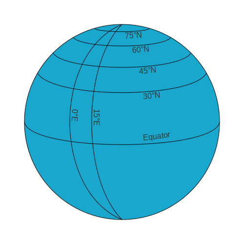
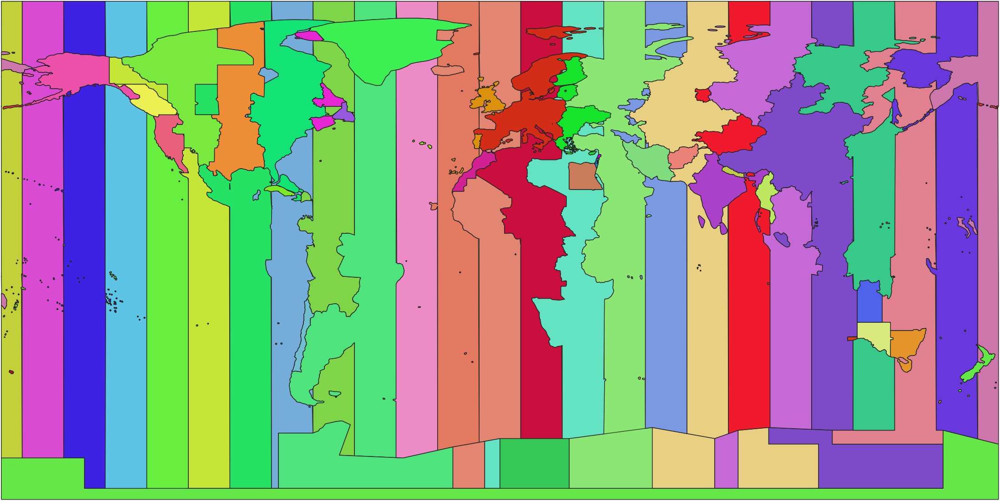

So I'm in a video call with some friends, one of them mentions they just moved to Bali. Another friend lives in Osaka. They ask half-jokingly which is closer to us here in Hanoi. I say "Osaka" as they're still opening Google Maps. A few seconds later, "how did you know that?" I didn't have a great answer at the time. But I just did the math in my head with a system I figured out through mental mapping.

It starts with timezones. I remember most of them because I have friends and family spread across multiple countries, and I'm also just hyped about geography in general. At some point, talking to people from Tartu, Lublin, Singapore, Guangzhou, so on and so forth made me internalise timezones. And if you know the timezone in two places, you can roughly deduce how far apart they are east/west. Every hour of timezone difference is about 15 degrees longitude. If the timezone difference is over 12 hours, subtract that from 24 first. The math works here, but there's kind of a catch.



A degree of longitude has different sizes at different latitudes. Look at the globe demonstration, the gap between 0°E and 15°E at 60°N is roughly half what it is at the equator. Now, you have to account for this, but it's simple. Below around 30° latitude you keep the longitude component as is; around 60°, halve it; and around 75°, quarter it. These are approximate cosines of the latitude, cos(60°) is 0,5, cos(75°) is about 0,26 so make it a quarter. I didn't figure this out at that moment but I noticed some numbers were off when I was calculating distances between timezones, so now we have the correction factor. We're basically doing trigonometry without really doing it lol.

The latitude part is simpler. If you know their latitudes, great, subtract the two places' latitudes if both places are on the same side of the equator. If opposite sides, add them. If you don't know their exact latitudes, estimating is fine, this is mental mapping and mathing after all.

Then you square both components, add them together, compare the totals, whichever sum is bigger is further. So the whole thing is:

```ruby
L (longitude) = Δt x 15 x c
φ (latitude) = lat(O) + lat(P) if opposite hemispheres, 
                       |lat(O) - lat(P)| if same hemisphere.
Score = L^2 + φ^2
```

```python
With:
    Δt is the timezone difference in hours,
    c is the latitude correction factor: x1 below 30°, x0,5 around 60°, x0,25 around 75°.
```

So, back to Bali vs. Osaka from Hanoi:

Bali is UTC+8, Hanoi is UTC+7, so 1 hour east and 15 degrees of longitude. Bali is at about 9° south, Hanoi at 21° north, opposite sides so latitude gap is 30°. Score = 15^2 x 1 + 30^2 = 225 + 900 = 1125.

Osaka is UTC+9, so 2 hours east and 30 degrees of longitude. Osaka is 34° north, same side as Hanoi so latitude gap of 13°. Score: 30^2 x 1 + 13^2 = 900 + 169 = 1069.

So we get Osaka nearer. Real distances from Osaka to Hanoi is about 3270 kilometres and from Denpasar (Bali) to Hanoi is about 3450 kilometres. There we go.



The system does break in some places though. This is roughly what my mental timezone map looks like, each colour is a timezone, the vertical striping is what the ideal world would look like, but of course people don't live in perfect timezones. China barring Xinjiang is just one colour spanning what should be five timezones, and even Xinjiang is complicated because Han people use UTC+8 while Uyghurs use UTC+6. India has its own half-hour offset spanning two timezones, same goes for Iran and Afghanistan. And then pretty much all of Europe is slightly east of actual timezone by geography, just look at Spain being on UTC+1 and +2 when it's just down below the UK.

However, most of these have workarounds. Xinjiang uses UTC+6 unofficially so we'll just take that. Singapore and Kuala Lumpur are close to Bangkok so it works as a proxy. India almost always mean Mumbai or Delhi and the half-hour is easy to account for. For Europe we'll just use winter time instead of summer time. The exceptions are manageable and it's basically the same thing as knowing the map anyway.

The other limitation is near the poles. Somewhere like Longyearbyen (Norway) or Troll Station (Antarctica) is so far past 75° that the longitude component loses almost all meaning and the comparison is just on latitude. Take a comparison from London:

Longyearbyen is UTC+1 and 78° north, so one timezone hour gives 15° of longitude, quartered at that latitude down to about 4. The latitude gap from London is 27°. Score = 4^2 + 27^2 = 745.

Troll Station is UTC+0 in winter, same timezone as London, so the longitude component is zero. Latitude gap at opposite sides of the equator is 51 + 72 = 123°. Score = 123^2 = 15129.

Troll loses by about 4,5 to 1. Ouch. Expected though since both places are at nearly the same meridian as London.

Another one is Iqaluit (Canada) versus Reykjavik (Iceland) from São Paulo (Brazil). They're both at 63°-64° north so their latitudes just cancel out. The latitude gaps from Brazil are nearly identical at 86° and 87° and the same latitude correction applies to both, so the comparison is now just longitude. Iqaluit is two timezone hours from São Paulo, Reykjavik three hours east. Iqaluit wins very narrowly and real distances are 9900 km versus 9970 km respectively.

It stops working well near the poles and when a country uses a political timezone that doesn't match its location. But for the places that normally come up in my conversations, it works well enough that I'm usually done before someone finishes typing into Maps.

Which is all I need it to do really.

Six for the [#100DaysToOffload](https://100daystooffload.com/) challenge btw.
